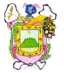

# ProyectoFinalTSC
Para ver el mapa de clic [aquí](https://nefilimzbm.github.io/ProyectoFinalTSC/)

# Introducción

# Desarrollo
El proposito de este proyecto es lleva los diferentes trabajos vistos en este curso para beneficio de terceros, asi como tambien el benficio propio a la implementacion de nuevos conocimientos a los contribuyentes de este proyecto, el cual esta compuesto por un archivo html, quien compone la base de nuestro proyecto, junto con el esta enlazado a un archivo de JavaScript donde está contenido todo el formato de diseño y animación del sitio web antes mencionado, sin mencionar el archivo Python que continente el trabajo principal de las búsquedas, sus especificaciones son interesantes, ya que Los requisitos de la implementación de los diccionarios y las listas son estos dos conocimientos previos a la introducción de este proyecto, después de la aplicación de los conocimientos y el desarrollo de la programación para su ejecución perfecta.

