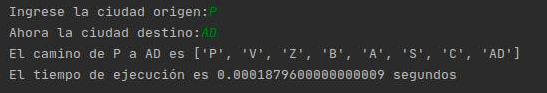

# ProyectoFinalTSC

***

|Tabla de contenido             |
|-------------------------------|
|[INTRODUCCIÓN](https://github.com/NefilimZbm/ProyectoFinalTSC#introducci%C3%B3n)                   |
|[METODOLOGIA](https://github.com/NefilimZbm/ProyectoFinalTSC#metodolog%C3%ADa)                    |
|[Experimentos](https://github.com/NefilimZbm/ProyectoFinalTSC#experimentos)                    |
|[MAPA](https://github.com/NefilimZbm/ProyectoFinalTSC#mapa )                           |
|[BIBLIOGRAFIAS](https://github.com/NefilimZbm/ProyectoFinalTSC#bibliograf%C3%ADas)                  |

## Introducción
El propósito de este proyecto es lleva los diferentes temas de busquedas vistos en el curso de Temas Selectos de Computacón de la Facultad de Matemáticas en la Unversidad Veracruzana para beneficio de terceros, asi como también el benficio de sus propios contribuyentes en este proyecto. El tema de busquedas suge de como un equipo de computo hace una busqueda, esto comienza en las posivilidades que tiene la computadora, pues al simple hecho de presionar una tecla en ella esta busca entre sus posibilidades lo que tiene q ejecutar en pantalla, actualmente este proceso se ha hecho mas efeciente hasta el punto en el que lo utilizamos a diario en dispositivos moviles, computadoras y bases de datos, es tan concurrente que en la vida poco podemos decir de la efeciencia de las busquedas en la internet, pues son milesimas de segundos que tarda un dispositivo en encontrar respuestas a una simple busqueda. Es por esto que hemos emprendido el viaje en aberiguar mas de las busquedas, con nuestro proyecto en marcha solo queda descubrir algo nuevo el dia de hoy.

## Metodología
La intención de este trabajo es brindar un aprendizaje sobre dos tipos de busqueda las cuales son la A\* y la Greedy, e iniciaremos con una contextualización al respecto.

La **Busqueda A\*** fue presentada por Peter E. Hart, Nils J. Nilsson y Bertram Raphael en el año 1968. Su función es encontrar siempre y cuando se cumplan determinadas condiciones, el camino de menor costo entre un nodo origen y uno objetivo, es la forma más ampliamente conocida de la búsqueda primero el mejor, siendo la búsqueda A* tanto completa como óptima. En este trabajo la ocuparemos para que nos diga la ruta con menor costo para trasladarnos de un lugar a otro.

Las **Busquedas Grerdy**, también conocido como codigo voraz, es una busqueda de la forma heurística, consistente en elegir la opción óptima en cada paso local con la esperanza de llegar a una solución general óptima. Se utilizan generalmente para resolver problemas de optimización (obtener el máximo o el mínimo), suelen ser fáciles y óptimos.
con respecto a nuestro busqueda agregamos un diccionario que contiene todos los elemenos necesarios para la busqueda como son la posicion, vecinos y costos de caseta y cobustible. En adelante acupamos el algorito siguiente:

Como anteriormente hemos mencionado esto optimisa y gasta menos datos de información, esto en base a los **Diccionarios** quienes contienen la informacion nesesaria bajo una palabra clave para asi localizar elementos con mayor facilidad

## EXPERIMENTOS

### Para la busqueda Greedy:
#### RUTA ALVARADO-SAN ANDRÉS TUXTLA:

#### RUTA BOCA DEL RIO-TEZIUTLÁN:

### RUTA XALAPA-FORTÍN DE LAS FLORES:

### Para la búsqueda A*:
#### RUTA ALVARADO-SAN ANDRÉS TUXTLA:

#### RUTA BOCA DEL RIO-TEZIUTLÁN:

### RUTA XALAPA-FORTÍN DE LAS FLORES:

## CONCLUSIONES:
El objetivo de este proyecto es conocer el comportamiento de diversos tipos de búsquedas, y es por ello que a continuación se mostrará lo que sucede con una ruta de Papantla a Agua Dulce para todas las rutas para todas las busquedas, y tomaremos como factor de mayor importancia el tiempo que toman en realizar la busqueda de dicha ruta.
Para ello adjuntaremos las siguientes imagenes:
### BÚSQUEDA DE AMPLITUD

### BÚSQUEDA COSTO UNIFORME

### BÚSQUEDA DE PROFUNDIDAD

### BÚSQUEDA GREEDY

### BÚSQUEDA A*

## MAPA
Para ver el mapa de clic [aquí](https://nefilimzbm.github.io/ProyectoFinalTSC/)

## Bibliografías
Inteligencia Artificial, Un enfoque moderno, Russell y Norving, capítulos 3 y 4.
https://developer.mozilla.org/es/docs/Web/JavaScript/Descripci%C3%B3n_de_las_tecnolog%C3%ADas_JavaScript
https://joedicastro.com/pages/markdown.html#mark9

