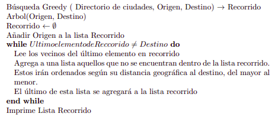
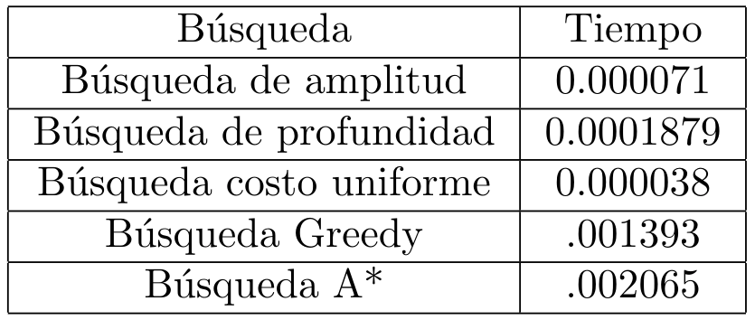

# ProyectoFinalTSC

***

|Tabla de contenido             |
|-------------------------------|
|[INTRODUCCIÓN](https://github.com/NefilimZbm/ProyectoFinalTSC#introducci%C3%B3n)                   |
|[METODOLOGIA](https://github.com/NefilimZbm/ProyectoFinalTSC#metodolog%C3%ADa)                    |
|[EXPERIMENTOS](https://github.com/NefilimZbm/ProyectoFinalTSC#experimentos)                    |
|[BIBLIOGRAFIAS](https://github.com/NefilimZbm/ProyectoFinalTSC#bibliograf%C3%ADas)                  |

## Introducción
Este repositorio fue creado con la finalidad de presentar el proyecto realizado por Kevin Luis Lagunes, Shaní Sánchez Lara y Pedro Miguel Velásquez Cruz, los cuales somos estudiantes de la licenciatura en Matemáticas de la UV, y consiste en la  aplicación de los conocimientos obtenidos en la experiencia educativa de Temas Selectos De Computación impartida por Patricia González Gaspar.

El propósito de este proyecto es mostrar dos tipos de algoritmos de búsqueda que existen los cuales son: la **búsqueda Greedy** y la **búsqueda A***. 
Cada una de estas búsquedas las utilizaremos para encontrar la ruta más adecuada para ir de un lugar a otro según los criterios de cada una de ellas que se mostraran más adelante.
Está compuesto por documentos escritos en Python los cuales contienen los algoritmos de búsqueda, uno para la búsqueda Greedy y otro para la búsqueda A*, y la función que nos permitirá calcular las distancias geográficas entre los diversos lugares, ya que está información se requiere para realizar ambas búsquedas, y con la finalidad de ilustrar la situación agregamos un html que está ligado a un JavaScript, los cuales nos servirán para mostrar donde están los lugares que ocuparemos a la hora de crear los algoritmos de las búsquedas.
Para ver el mapa de clic [aquí](https://nefilimzbm.github.io/ProyectoFinalTSC/)

Para comprender el repositorio es importante que contestemos las siguientes preguntas: _¿qué es una búsqueda?, ¿para qué sirve? y ¿por qué son importantes?_. Para responder lo anterior cuando un problema es presentado como un árbol de búsqueda el enfoque heurístico intenta reducir el tamaño del árbol cortando nodos pocos prometedores. Estos métodos se llaman métodos fuertes porque ellos son más poderosos que los estudiados hasta aquí al incorporar conocimiento heurístico o heurística. Hay una contradicción entre generalidad y potencia en el sentido que los métodos débiles son esencialmente aplicables universalmente mientras que los fuertes son menos universales en su aplicabilidad y el conocimiento o heurística usada en un problema dado puede no ser totalmente aplicable o ser inaplicable en otro dominio o tarea.
Feigenbaum y Feldman definen la heurística de la siguiente manera: "Una heurística es una regla para engañar, simplificar o para cualquier otra clase de ardid el cual limita drásticamente la búsqueda de soluciones en grandes espacios de estados". En esencia una heurística es simplemente un conjunto de reglas que evalúan la posibilidad de que una búsqueda va en la dirección correcta. Generalmente los métodos de búsqueda heurísticas se basan en maximizar o minimizar algunos aspectos del problema.

## Metodología

La **Búsqueda A\*** fue presentada por Peter E. Hart, Nils J. Nilsson y Bertram Raphael en el año 1968. Su función es encontrar siempre y cuando se cumplan determinadas condiciones, el camino de menor costo entre un nodo origen y uno objetivo, es la forma más ampliamente conocida de la búsqueda primero el mejor, siendo la búsqueda A* tanto completa como óptima. En este trabajo la ocuparemos para que nos diga la ruta con menor costo para trasladarnos de un lugar a otro.

En esta parte de las Búsqueda A\* es necesario el uso de un diccionario que contenga posiciones geológicas, puntos aledaños y costos de entrada a cada punto, al momento de entrar nos pedira origen y destino, para poder ejecutar la función basado en la distancia y el costo mínimo en cada punto con respecto a sus vecinos ese generara la ruta más corta y económica entre ciudades, al momento de terminar los ciclos y condicionales se imprimirá  la lista de la ruta que el programa considero más óptima.

----------------------------

Las **Búsquedas Grerdy**, también conocido como código voraz, es una búsqueda de la forma heurística, consistente en elegir la opción óptima en cada paso local con la esperanza de llegar a una solución general óptima. Se utilizan generalmente para resolver problemas de optimización (obtener el máximo o el mínimo), suelen ser fáciles y óptimos.
Con respecto a nuestra búsqueda agregamos un diccionario que contiene todos los elementos necesarios para la búsqueda como son la posición, vecinos y costos de caseta y combustible. En adelante ocupamos el algoritmo siguiente:

Como anteriormente hemos mencionado esto optimiza y gasta menos datos de información, esto en base a los **Diccionarios** quienes contienen la información necesaria bajo una palabra clave para localizar elementos con mayor facilidad como son la posición geológica, sus vecino. Al momento de ejecutar el programa nos pedirá una clave de partida y otra clave más del destino al que queremos llegar, dado esto el programa buscara la rutas más rápida comparada en distancia de acuerdo a los criterios que se mencionan en el diccionario siguiendo una ruta para poder llegar a su destino de no hacerlo, buscara las segundas opciones del final al inicio hasta encontrar su destino, al concluir esto, dará como respuesta una lista de todos los puntos que fueron necesarios pasar para llegar a su destino.

## EXPERIMENTOS

### Para la busqueda Greedy:
#### RUTA ALVARADO-SAN ANDRÉS TUXTLA:

#### RUTA BOCA DEL RIO-TEZIUTLÁN:

### RUTA XALAPA-FORTÍN DE LAS FLORES:

### RUTA VEGA DE ALATORRE-ACAYUCAN:

### Para la búsqueda A*:
#### RUTA ALVARADO-SAN ANDRÉS TUXTLA:

#### RUTA BOCA DEL RIO-TEZIUTLÁN:

### RUTA XALAPA-FORTÍN DE LAS FLORES:

### RUTA VEGA DE ALATORRE-ACAYUCAN:

## CONCLUSIONES:
El objetivo de este proyecto es conocer el comportamiento de diversos tipos de búsquedas, y es por ello que a continuación se mostrará lo que sucede con una ruta de Papantla a Agua Dulce para todas las rutas para todas las búsquedas, y tomaremos como factor de mayor importancia el tiempo que toman en realizar la búsqueda de dicha ruta.
Para ello adjuntaremos las siguientes imágenes:
### BÚSQUEDA DE AMPLITUD

### BÚSQUEDA COSTO UNIFORME

### BÚSQUEDA GREEDY

### BÚSQUEDA A*

## TABLA COMPARATIVA

Cómo podemos notar en la tabla anterior, la ruta que es más rápida es la Búsqueda de costo uniforme, y por otra parte la más lenta es la Búsqueda A*, y si lo analizamos esto tiene mucho sentido, ya que la búsqueda A* lleva acabo el análisis de diversa información para la creación de su ruta. Por otra parte algo que esperábamos es que la Búsqueda Greedy fuera más rápida que la búsqueda A*, ya que la primera, a la hora de generar su ruta analiza solo lo que ocurre con las distancias, en cambio la otra debe analizar distancias y costos.

## Bibliografías
* Inteligencia Artificial, Un enfoque moderno, Russell y Norving, capítulos 3 y 4.
* Inteligencia Artificial,Resolución de problemas mediante búsquedas, Dr. Edgard Iván Benítez Guerrero, rescatado de: https://www.uv.mx/personal/edbenitez/files/2010/09/CursoIA10-II-3.pdf
* Descripción de las tecnologías JavaScript, colavoraderes de MDN, rescatado de: https://developer.mozilla.org/es/docs/Web/JavaScript/Descripci%C3%B3n_de_las_tecnolog%C3%ADas_JavaScript
* Markdown & Pygments Lexers Cheat Sheet,Joe di castro, rescatado de: https://joedicastro.com/pages/markdown.html#mark9
* Algoritmo de Búsqueda Heurística A*, EcuRed, rescatado de: https://www.ecured.cu/Algoritmo_de_B%C3%BAsqueda_Heur%C3%ADstica_A*
* Búsqueda Informada, anonimo, rescarado d:https://www.infor.uva.es/~calonso/IAI/Tema4-BusquedaInformada/BusquedaInformada09-00.pdf
* Búsqueda Heurística, Carlos Galindo González, rescatado de:https://www.monografias.com/trabajos75/busqueda-heuristica/busqueda-heuristica.shtml#:~:text=Bibliograf%C3%ADa-,B%C3%BAsqueda%20Heur%C3%ADstica,requerida%20para%20encontrar%20una%20soluci%C3%B3n.&text=Frecuentemente%20son%20mejores%20los%20m%C3%A9todos,m%C3%A9todos%20de%20b%C3%BAsquedas%20a%20ciegas.
